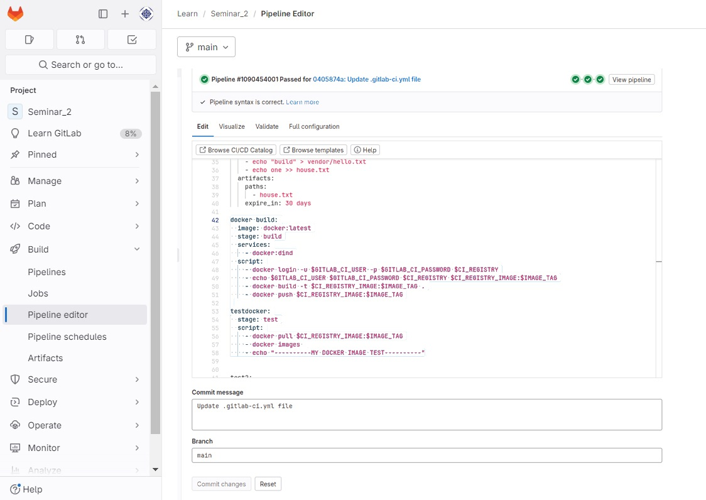
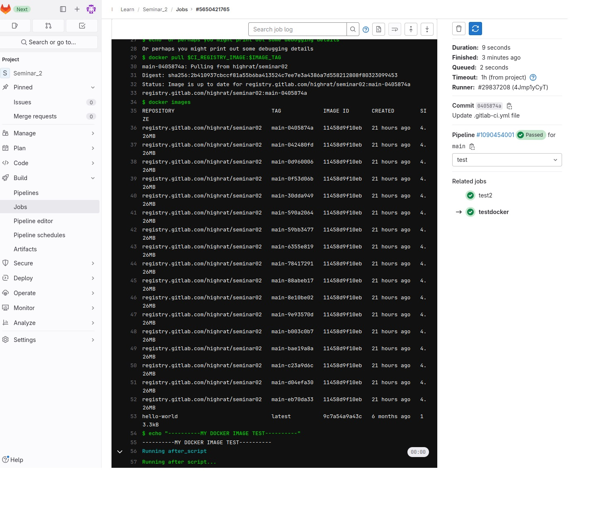
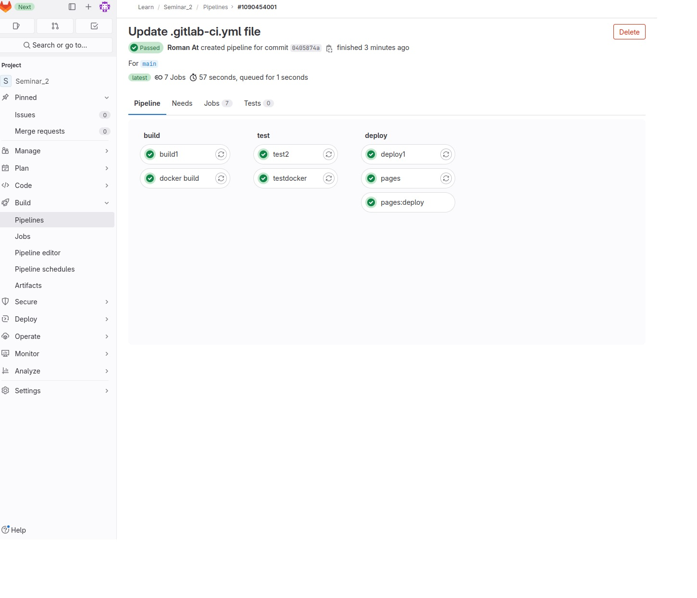

Создав контейнер docker
```yaml
docker build:
  image: docker:latest
  stage: build
  services:
    - docker:dind
  script:
    - docker login -u $GITLAB_CI_USER -p $GITLAB_CI_PASSWORD $CI_REGISTRY
    - echo $GITLAB_CI_USER $GITLAB_CI_PASSWORD $CI_REGISTRY $CI_REGISTRY_IMAGE:$IMAGE_TAG
    - docker build -t $CI_REGISTRY_IMAGE:$IMAGE_TAG .
    - docker push $CI_REGISTRY_IMAGE:$IMAGE_TAG
```

Необходимо проверить возможность его загрузки из реестра:
```yaml
testdocker:
  stage: test
  script:
    - docker pull $CI_REGISTRY_IMAGE:$IMAGE_TAG
    - docker images 
    - echo "----------MY DOCKER IMAGE TEST----------"
```

Блок тестирования


Список созданных контейнеров


Pipeline passed

